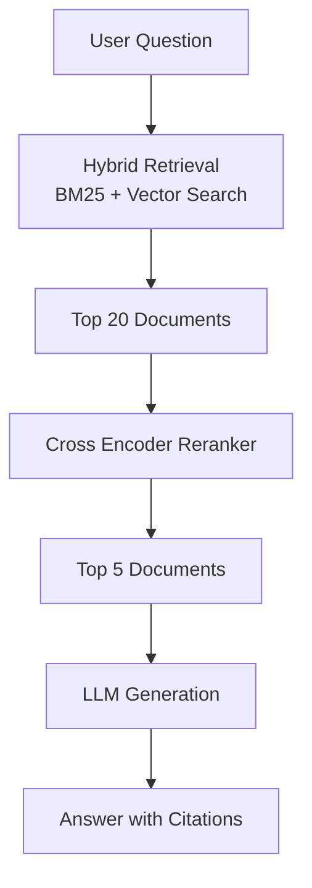
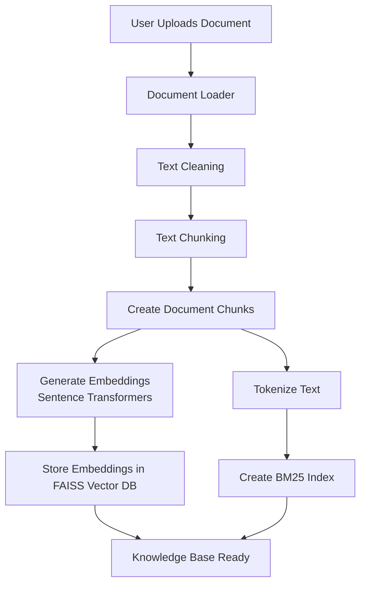
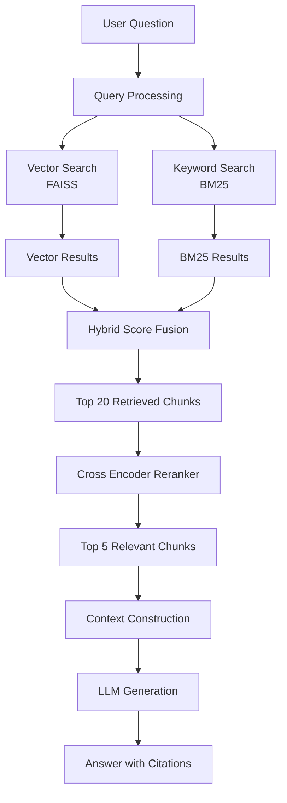

# FusionRAG

### A Production-Style Hybrid Retrieval-Augmented Generation System

⚠️ **Note**

This repository contains the **console-based research implementation** of FusionRAG that demonstrates the core **Hybrid Retrieval + Reranking pipeline**.

A new **full production-grade application** with the following features is available in a separate repository:

• Streamlit user interface
• FastAPI backend service
• Redis caching
• Document upload support (PDF / TXT / MD)
• Retrieval visualization
• Suggested question generation
• Reciprocal Rank Fusion (RRF) hybrid retrieval

👉 **Production Application Repository**

https://github.com/Sambit-Kumar-2001/FusionRAG-App

The production version expands this system into a **complete end-to-end AI application**, while this repository focuses on the **core retrieval architecture and experimentation**.

If you want to explore the **full interactive system**, please visit the production repository above.


---

# Problem Statement

Many simple RAG implementations rely only on vector similarity search. While effective for semantic matching, vector search often struggles with:

* Exact keyword queries
* Technical terms
* Domain-specific vocabulary
* IDs and structured references

FusionRAG addresses this limitation by implementing a **Hybrid Retrieval Pipeline** that combines:

* Dense semantic retrieval (vector search)
* Sparse keyword retrieval (BM25)
* Cross-encoder reranking for final relevance scoring

This architecture reflects patterns commonly used in **enterprise AI systems**.

---

# System Architecture



---

# Document Ingestion Pipeline

This pipeline processes uploaded documents and prepares them for retrieval.



---

# Query & Retrieval Pipeline

This pipeline runs when the user asks a question.



---

# Key Features

* Hybrid document retrieval (**Vector + BM25**)
* Cross-encoder reranking to improve precision
* Document chunking and embedding pipeline
* Grounded LLM responses with citations
* Modular architecture for experimentation
* FastAPI backend for API-based querying
* Streamlit interface for interactive usage
* Evaluation-ready design for testing retrieval quality

---

# Tech Stack

| Component            | Technology                      |
| -------------------- | ------------------------------- |
| Programming Language | Python                          |
| RAG Framework        | LangChain                       |
| Vector Store         | FAISS                           |
| Keyword Retrieval    | rank-bm25                       |
| Embeddings           | Sentence Transformers           |
| Reranking Model      | Cross Encoder (MS MARCO models) |
| Backend API          | FastAPI                         |
| User Interface       | Streamlit                       |

---

# Project Structure

```
fusion-rag
│
├── data/
│   └── documents/
│
├── src/
│   ├── ingestion.py
│   ├── embeddings.py
│   ├── vector_store.py
│   ├── bm25_retriever.py
│   ├── hybrid_retriever.py
│   ├── reranker.py
│   └── generator.py
│
├── api/
│   └── main.py
│
├── evaluation/
│   └── rag_eval.py
│
├── ui/
│   └── app.py
│
├── notebooks/
│
├── requirements.txt
└── README.md
```

---

# Installation

Clone the repository

```
git clone https://github.com/Sambit-Kumar-2001/FusionRAG
cd FusionRAG
```

Create virtual environment

```
python -m venv venv
```

Activate environment

Linux / Mac

```
source venv/bin/activate
```

Windows

```
venv\Scripts\activate
```

Install dependencies

```
pip install -r requirements.txt
```

---

# Example Query

Question

```
What is the typical rice crop duration?
```

Generated Answer

Rice crop duration typically ranges between **90 and 120 days**, depending on the rice variety and environmental conditions.

Sources

* Document 2 – Page 4
* Document 5 – Page 2

---

# Retrieval Pipeline Explanation

### Hybrid Retrieval

Two retrieval strategies operate simultaneously:

Vector Retrieval
Uses dense embeddings and FAISS to retrieve semantically similar documents.

Keyword Retrieval
Uses BM25 to retrieve documents containing exact keyword matches.

Results from both retrievers are combined using a **weighted scoring strategy**.

---

### Cross Encoder Reranking

The top 20 retrieved chunks are passed to a cross-encoder model that evaluates query–document relevance.

The system then selects the **top 5 most relevant chunks**.

---

### LLM Generation

The final context documents are passed to the language model, which generates an answer grounded in the retrieved sources.

Each response includes **citations referencing the original documents**.

---

# Future Improvements

Planned improvements for this system include:

* Automated RAG evaluation using RAGAS
* Observability and latency monitoring
* Token usage and cost tracking
* CI pipeline for evaluation regression testing
* Advanced chunking strategies
* Streaming responses for real-time interaction

---

# Learning Outcomes

This project demonstrates practical skills in:

* Retrieval system design
* Hybrid search implementation
* RAG architecture
* Cross-encoder reranking
* Context-grounded LLM generation
* Backend API development for AI systems

---

# Project Goal


The objective is to build a strong foundation in **retrieval-augmented systems** before moving to more advanced AI system design.

After completing FusionRAG, the next projects will explore:

* Running **local small language models (SLMs)**
* Building **AI observability and monitoring systems**
* Fine-tuning models using **LoRA and DPO**
* Developing **real-time multimodal AI applications**

Each project builds upon the previous one.

---

# License

MIT License
